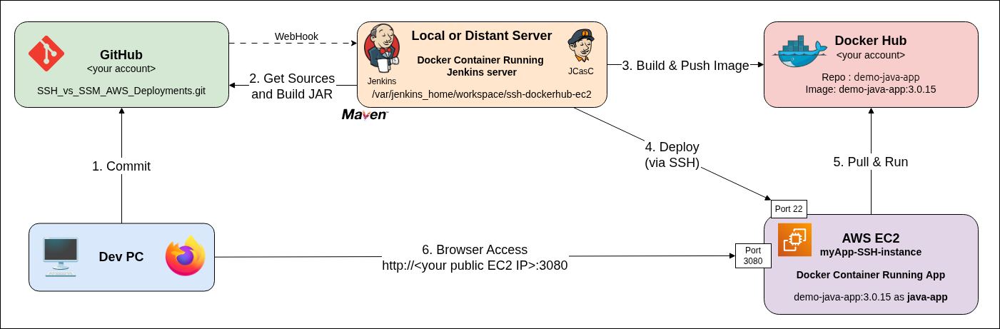
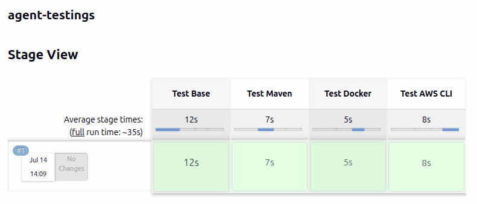
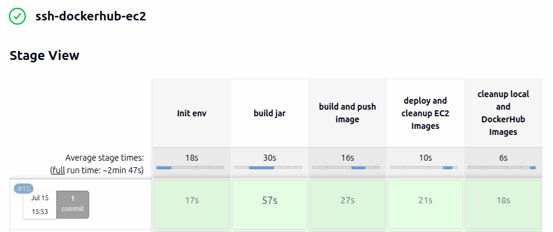
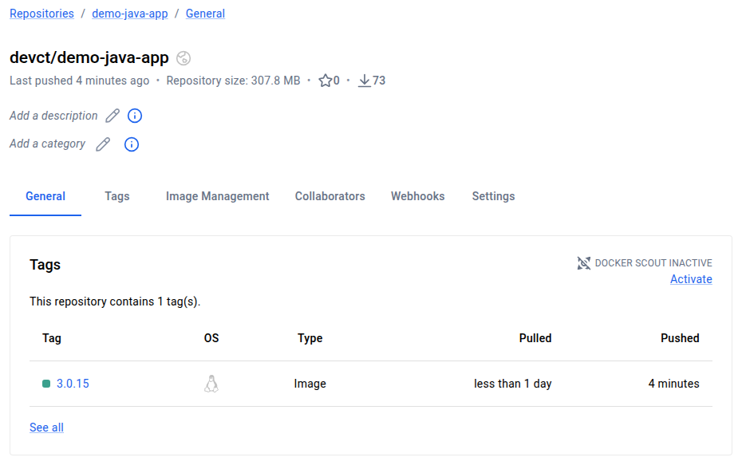
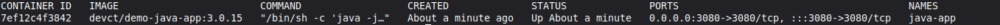
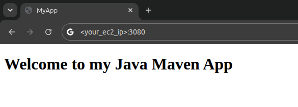

### This repo compares SSH and SSM for AWS Deployements 

with 2 differents pipelines : ssh-dockerhub-ec2 and ssm-ecr-ec2 on a Jenkins server

**ssh-dockerhub-ec2-architecture** :


**ssm-ecr-ec2-architecture** :


# 1. Fork or Create a New Repository on GitHub

This step is required in order to obtain your own webhook for Jenkins. 

Fork :
```bash
env gh repo fork https://github.com/DevCTx/SSH_vs_SSM_AWS_Deployments --clone
```

Or alternatively, clone this repository, delete the Git history and move the source code to a new repository.

```bash
git clone https://github.com/DevCTx/SSH_vs_SSM_AWS_Deployments
cd SSH_vs_SSM_AWS_Deployments
rm -rf .git     # deletes all links with git

git init                    # start a fresh repository
git add .
git commit -m "Initial commit"
git branch -M main

# Use your GitHub Account 
env gh repo create <your GitHub account>/SSH_vs_SSM_AWS_Deployments \
  --public \
  --description "Full CI/CD pipeline for a Java application: triggered by a GitHub webhook on push, built with Maven on Jenkins, automatic image tagging, push to DockerHub or AWS ECR, and deployment to AWS EC2 via SSH or SSM." \
  --source=. \
  --push
```

If you reuse this repo or a part of it, please keep this attribution.
```
### Credits
Sources: [DevCTx/SSH_vs_SSM_AWS_Deployments](https://github.com/DevCTx/SSH_vs_SSM_AWS_Deployments).
```

---

# 2. GitHub Configuration

### 2.1. Generate a GitHub token (PAT)

> *Profile > Settings > Developer settings > Personal access tokens > Fine-grained tokens > Generate new token*

- **Token name**: `jenkins-token` 
- **Description**: `Jenkins Token for SSH_vs_SSM_AWS_Deployments repository` 
- **Resource owner**: `<your GitHub account>` 
- **Expiration**: `7 days` or more if needed 
- **Repository Access**: Select **only** the `SSH_vs_SSM_AWS_Deployments` repository 
- **Repository permissions** (everything else on *No access*) :

>| Permission | Level | Why |
>|---|---|---|
>| Contents | Read-only | clone / checkout the sources |
>| Metadata | Read-only | required by default (auto) |
>| Commit statuses | Read and write | post the CI status on commits |
>| Webhooks | Read and write | Manage the hooks for a repository |

*Click `Generate token`** and **copy the token** (displayed only once).

### 2.2. Save it into a .env file

```
GITHUB_JENKINS_TOKEN=<github_pat_xxx>
GITHUB_OWNER=<your GitHub account>
REPO=<your GitHub account>/SSH_vs_SSM_AWS_Deployments
```
---

### 2.3. Test it

```
chmod 744 ./test_github_config.sh
./test_github_config.sh
```
*you should see :*
```
✅ GITHUB_JENKINS_TOKEN matches GITHUB_OWNER (<your GitHub account>)
✅ REPO '<your GitHub account>/SSH_vs_SSM_AWS_Deployments' is accessible
```

---

# 3. Docker Hub Configuration

- Create an account or Log into your account on https://hub.docker.com/

### 3.1. Generate a DockerHub token

> *Account Settings > Personal Access Tokens > New access token*

- **Access Token Description**: `jenkins-myapp` \
- **Expiration Date**: `30 days` \
- **Access Permissions**: `Read, Write & Delete` \

*Click `Generate`** and **copy the token** (displayed only once).

### 3.2. Save it into the .env file

```
DOCKER_USERNAME=<your Docker Hub account>
DOCKERHUB_PAT=<dckr_pat_xxx>
```

### 3.3. Test it

```bash
chmod 744 ./test_dockerhub_config.sh
./test_dockerhub_config.sh
```
you should see the message : `Login Succeeded`

---

# 4. AWS Configuration

Prerequisites:
- an AWS account and an IAM administrator user who can generate access keys

- AWS CLI installed - if not, please refer to the page according to your system : \
https://docs.aws.amazon.com/fr_fr/cli/latest/userguide/getting-started-install.html


### 4.1. Get your AWS credentials

Login to the AWS Console with your admin user account

> - **IAM > Users > Your Admin User > Security credentials** \
> - **Access keys > Create access key > Command Line Interface (CLI)**
> - **Description** : `jenkins-ci`
> - **Copy** the credentials or **Download the .csv** out of the repo 

Click **Done**

### 4.2. Configure the CLI

```bash
aws configure  # paste Access key, Secret access key, region eu-west-3, output json
```

### 4.3. Test it
```bash
aws sts get-caller-identity   
```
*you should see :*
```
aws sts get-caller-identity 
{
    "UserId": "AIDAI...",
    "Account": "123456789012",
    "Arn": "arn:aws:iam::123456789012:user/your-user"
}
```

---

# 5. Run Jenkins CI > Docker Hub > AWS EC2 via SSH

### 5.1. Prépare the AWS EC2 with SSH authorization


```
chmod 744 ./aws_ssh_ec2_install/aws_ssh_ec2_install.sh
./aws_ssh_ec2_install/aws_ssh_ec2_install.sh
```

This script will :
- create an **SSH key** `jenkins-ec2.pem` if missing
- create a **Security Group** and open ports **22** (for your IP) and **3080** (public)
- calculate the **minimal disk size** required for the app on an **Amazon Linux 2023** instance
- create an **EC2 instance** with an **Amazon Linux 2023 AMI** in the **eu-west-3** Region (Paris), on a **t3.micro** configuration (2 vCPU, 1 GiB RAM, Free Tier compatible) and the **appropriate volume size**
- install **Docker** and start the daemon on boot
- retrieve the **public IP** and set it into the **.env** file as **EC2_IP**


### 5.2 Install the Jenkins Server with an SSH environment 

```
chmod 744 ./jenkins_install/docker_jenkins_platform_install.sh
sudo ./jenkins_install/docker_jenkins_platform_install.sh
```

This script will :
- verify if **Docker** is available or install on host if missing 
- prepare the architecture 
  ```
  └── jenkins
      ├── docker-compose.yaml
      ├── agents
      │   ├── aws/Dockerfile       # AWS deployment (AWS CLI v2)
      │   ├── docker/Dockerfile    # DockerHub Deployments (host socket access)
      │   └── maven/Dockerfile     # Java builds (JDK 21 + Maven)
      └── controller               # orchestration only, web UI
          ├── Dockerfile
          └── jenkins-config.yaml
  ```
- ask an **admin account username**, **generate a strong password**, and store them in **.env**

- build and tests the **agent images** (docker-agent, maven-agent, aws-agent) and pull the inbound agent for the base-agent image

- check if the `jenkins-ec2.pem`SSH key is available

- Then **build the comtroller** running the **JCasc** `jenkins-config.yaml` file to: 
  
  - install **Jenkins as controller** into a docker container 
  
  - install and test **4 docker agents** (base, docker, maven and aws cli).
    - **base-agent**: for simple operations like git
    - **maven-agent**: for building the java source as .JAR
    - **docker-agent**: for building JAR as docker image and store it on Docker Hub
    - **aws-agent**: for pulling it from AWS EC2.
  
  - install the required **credentials** (GitHub Token, DockerHub, EC2 IP and SSH Key)
    > *The `jenkins-ec2.pem` SSH key is mounted as **volume** and used as **secret** into Jenkins (not stored in .env) because its multi-line format would break the .env parsing*

  - pre-configure **2 operational pipelines** :
  
    - `agent testings`: to **test each agent** from Jenkins before to start  
  
    - `ssh-dockerhub-ec2` : a **full CI/CD** triggered from GitHub push, building source and pushing the image to dockerhub before to pull it from the EC2 instance. 


### After the installation :
- **Open** `http://<jenkins-ip>:8080` \
- **Enter** your admin `username` and the generated `password` \
- *Optional* : **Build** the `agent-testings` pipeline to test the docker agents from Jenkins
  On `<Build pipeline>` into Jenkins :
    


- Before the run the CI/CD pipelines, Jenkins need to have a public IP.

### 5.3 Update the GitHub Webhook with a public IP (or set it with Cloudflare)

```
chmod 744 ./jenkins_install/setup_github_webhook.sh
./jenkins_install/setup_github_webhook.sh
```

This script will 
 - **Load env**: sources .env, requires `GITHUB_JENKINS_TOKEN` + `REPO`

 - **Get public URL for Jenkins** : asks if Jenkins has a public IP; 
   - if yes => use the local IP address,
   - if no => install Cloudflare and create a public IP tunnel. 
 - **Create or update the `github-webhook`** to let a `git push` triggered the Jenkins pipeline.


### 5.4 Trigger a CI/CD run and verify the deployment !

```
chmod 744 ./test_deployments.sh
./test_deployments.sh
```

This script will : 

- **Load env**: DOCKER_USERNAME, DOCKERHUB_PAT, EC2_IP from .env;
- **Get the last tag** from DockerHub before the push
- **Trigger the pipeline** with an empty commit and git push
- **Wait for the build on Jenkiins and new tag on Docker Hub**
- **Wait for cleanup on Docker Hub**
- **Verify EC2**: connect via SSH and check if the image tag running the container is the last created

### *On Jenkins, you should see*


### *On DockerHub, you should see*


### *On EC2, you should see*


### *On internet, you should see*


---
---

### 3.2 Or automatically set the webhook

Use the `cloudflared_local_tunnel.sh` script to **install Cloudflare** and **create a local tunnel** making **Jenkins** available from internet and automatically creates or updates a GitHub webhook pointing to this Jenkins instance.

**Save the GitHub Token** into a **.env** file with your GitHub account and repo: 

and launch
```
./setup_github_webhook.sh
```

The script will ask: `Is Jenkins on a public IP reachable from GitHub? [y/N]`

If you answer `Yes`, the script:
- Detects your public IP.
- Assumes Jenkins is available on: `http://<jenkins-ip>:8080`
- Creates or updates the GitHub webhook.

If you answer `No`, the script:
- Starts an anonymous Cloudflare Tunnel.
- Retrieves the generated https://*.trycloudflare.com URL.
- Points the GitHub webhook to that URL.
- Displays the tunnel process ID.

Notes : **Anonymous Cloudflare Tunnel URLs are temporary**.

Each time the tunnel restarts, a new URL is generated. Simply rerun this script to update the GitHub webhook with the new address.

If Jenkins is permanently accessible from a public IP or domain name, no rerun is required unless the endpoint changes.

### 4. Use in pipeline

Select this credential as the Git source : Jenkins can then scan the repository and automatically launch the pipeline.

Note: the webhook itself (GitHub → Jenkins) does not require a token; the token is used to clone/scan the repo and to update the source if needded (tag versioning).


--------------------

> *Manage Jenkins → Credentials → System → Global → Add*

- **Kind**: Username with password
- **username** = `<your GitHub login>`, **password** = `<github_pat_xxx>`
- **ID**: `github-token` 

### 3.1 Create the webhook manually on GitHub if Jenkins is public

> *Repo → Settings → Webhooks → Add webhook*
- **Payload URL**: `http://<jenkins-ip>:8080/github-webhook/`
- **Content type**: `application/json`
- **Events**: `Just the push event`
- **Active**: *checked*
